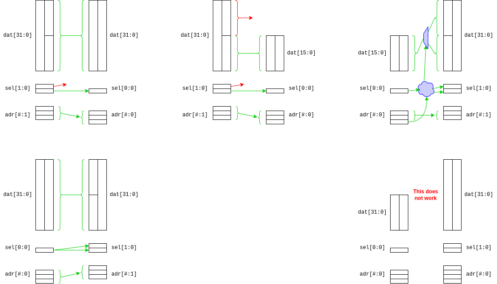

FPGA I/O Generator
==================

This tool generates code for WISHBONE-based FPGA-I/O.

## Introduction

FPGA I/O Generator aims to automate the task of generating HDL and software code for WISHBONE:

- registers (i.e. a WISHBONE slave that allows access to some I/O signals)
- buses (i.e. an interconnect between multiple masters and slaves)

In the following FPGA block diagram, the parts highlighted in color can be generated with the FPGA I/O Generator tool:

You can describe the registers and the bus in Python code; in simplified pseudo-code, this could look like this:

    m = WbMaster('External I/O', 32, 8, 16)
    r = RegisterSet('Config and Control Registers', 0x00, 32, registers=[
        Register('Config 1', 'Config Data 1', 0x00, RegType.WriteRead, [
            Field('Speed',  'Speed Value',  [ 9, 0], FieldType.Unsigned16Bit, [FieldFunction.ReadModifyWrite]),
            Field('Offset', 'Offset Value', [19,10], FieldType.Signed16Bit,   [FieldFunction.ReadModifyWrite]),
            Field('Gain',   'Gain Value',   [29,20], FieldType.Unsigned16Bit, [FieldFunction.ReadModifyWrite]),
        ]),
        Register('Status', 'Status data', 0x02, RegType.Read, fields=[
            Field('Speed', 'Measured Speed', [20,0], FieldType.Unsigned32Bit, [FieldFunction.Read]),
        ]),
    ])
    s = WbSlave.from_register_set(r_pwm)
    b = WbBus('My Bus', [m], [s])

Now the FPGA I/O Generator is able to generate various outputs:

- Synthesizable SystemVerilog code for the registers and for the bus
- C-Code and Python-code to control the registers from an MCU/PC
- Graphical represenations of the bus
- Markdown documentation for the registers and for the bus

If there are multiple masters or slaves with different bus formats (e.g. differet bus widths or granularities), adapters will be implemented automatically.

### Notes on WISHBONE

#### General

The generated HDL code makes use of the SystemVerilog `interface` mechanism to simplify the code. The generated code might not be 100% WISHBONE compliant.

For more information about the WISHBONE SoC interconnect architecture, see [opencores.org/howto/wishbone](https://opencores.org/howto/wishbone).

#### Bus Format Adaptation

There are three possible scenarios:

- The master port width and the slave port width are equal: no port size adaption needed.
- The master port is wider than the slave port: the upper data bits of the master will be discarded - **keep an eye on this**!
- The master port is narrower than the slave port:
    - If the master's port size is narrower than the slave's granularity, no adaptation is possible. *Master and slave are incompatible*.
    - Otherwise, one or more address bits of the master will be fed into a multiplexer and select-bit-generator, in order to serve the additional inputs of the slave. In this scenario, **you will need additional address bits on the master, and you have to shift the address generated by the master**. In the generated markdown documentation, there will be notes about shifted addresses.
If the master granularity is finer than the slave granularity, some select-bits will be discarded - **keep an eye on this**!

Note that the FPGA I/O Generator specifies addresses in a way as if all address bits were available. E.g. a master with 32 bit port size and 8 bit granularity will have an address signal `adr[#:2]`, i.e. the two LSBs are missing. Now e.g. the address `0x10` means in binary `0b10000`, which would be output by the master as `0b100`.

When you use generated Python- or C-code, it is up to you to shift the addresses accordingly in your hardware abstraction layer!

## Requirements

- Tested with python 3.11.
- Packets: `graphviz` ([see here](https://pypi.org/project/graphviz/))

## How to Get Started

Check out the examples in the `samples` folder.

You will need some HDL files from the `include` folder for synthesis.

## Examples

Synthesizable SystemVerilog code:

### Bus Generation

Generated graph:

Generated Markdown documentation:

### Register Generation

Generated SystemVerilog code:

Generated C-code:

Generated Markdown documentation:

