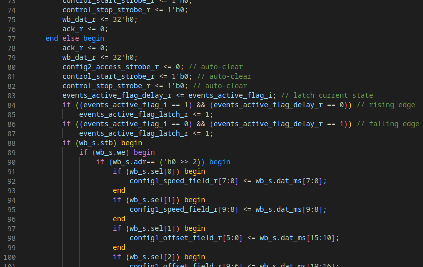
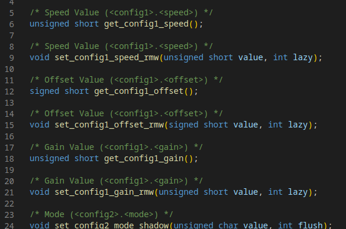
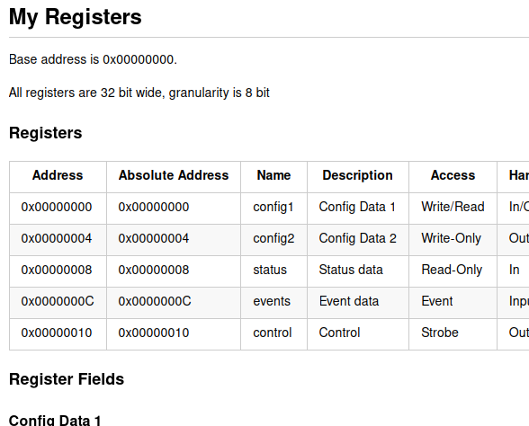

FPGA I/O Generator
==================

This tool generates code for FPGA-IO. In the current alpha versions, it is capable of:

- defining a flexible register structure in Python
- generating HDL code for those registers (SystemVerilog)
- generating SW code to control those registers (C, Python)
- generating documentation of those registers (Markdown)

Requirements
------------

Tested with python 3.11.

How to Get Started
------------------

Check out the examples in the `samples` folder.

Missing Features
----------------

- bus code generator (arbiters, demultiplexers, adapters); code already exists, but must be refactored and documented
- more intensive testing of generated code
