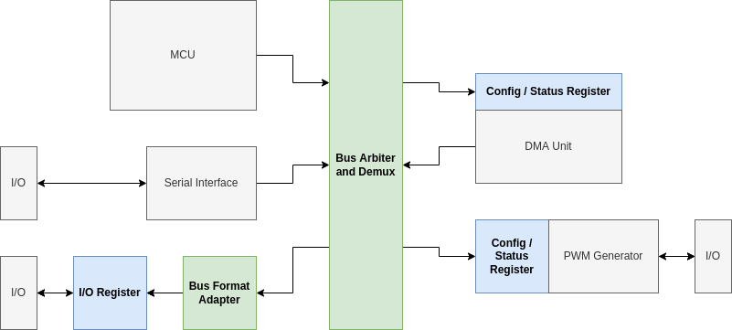
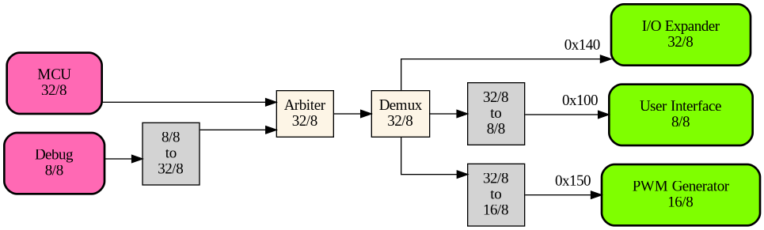
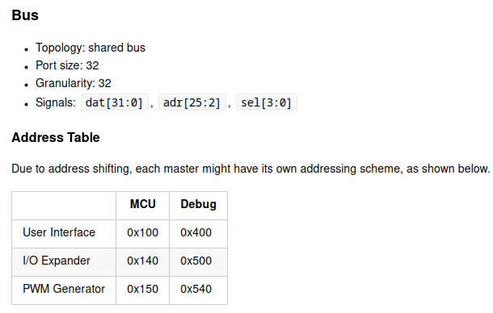
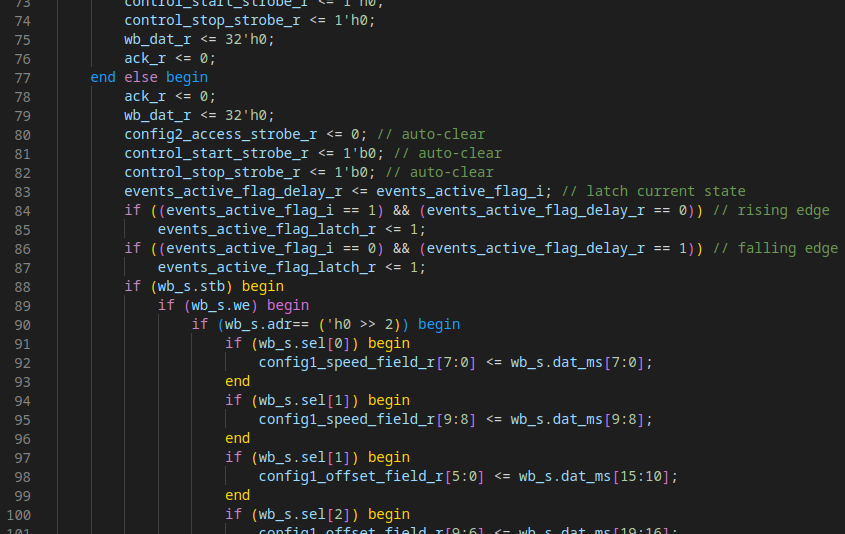
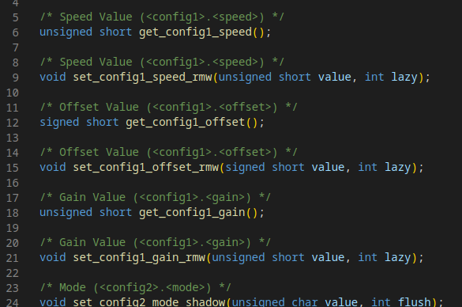
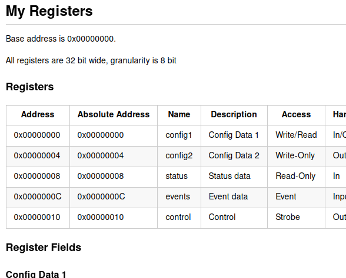

FPGA I/O Generator
==================

This tool generates code for WISHBONE-based FPGA-I/O.

## Introduction

FPGA I/O Generator aims to automate the task of generating HDL and software code for WISHBONE:

- registers (i.e. a WISHBONE slave that allows access to some I/O signals)
- buses (i.e. an interconnect between multiple masters and slaves)

In the following FPGA block diagram, the parts highlighted in color can be generated with the FPGA I/O Generator tool:

You can describe the registers and the bus in Python code; in simplified pseudo-code, this could look like this:

    m = WbMaster('External I/O', 32, 8, 16)
    r = RegisterSet('Config and Control Registers', 0x00, 32, registers=[
        Register('Config 1', 'Config Data 1', 0x00, RegType.WriteRead, [
            Field('Speed',  'Speed Value',  [ 9, 0], FieldType.Unsigned16Bit, [FieldFunction.ReadModifyWrite]),
            Field('Offset', 'Offset Value', [19,10], FieldType.Signed16Bit,   [FieldFunction.ReadModifyWrite]),
            Field('Gain',   'Gain Value',   [29,20], FieldType.Unsigned16Bit, [FieldFunction.ReadModifyWrite]),
        ]),
        Register('Status', 'Status data', 0x02, RegType.Read, fields=[
            Field('Speed', 'Measured Speed', [20,0], FieldType.Unsigned32Bit, [FieldFunction.Read]),
        ]),
    ])
    s = WbSlave.from_register_set(r_pwm)
    b = WbBus('My Bus', [m], [s])

Now the FPGA I/O Generator is able to generate various outputs:

- Synthesizable SystemVerilog code for the registers and for the bus
- C-Code and Python-code to control the registers from an MCU/PC
- Graphical represenations of the bus
- Markdown documentation for the registers and for the bus

For more information about the WISHBONE SoC interconnect architecture, see [opencores.org/howto/wishbone](https://opencores.org/howto/wishbone).

## Requirements

- Tested with python 3.11.
- Packets: `graphviz` ([see here](https://pypi.org/project/graphviz/))

## How to Get Started

Check out the examples in the `samples` folder.

You will need some HDL files from the `include` folder for synthesis.

## Examples

Synthesizable SystemVerilog code:

### Bus Generation

Generated graph:

Generated Markdown documentation:

### Register Generation

Generated SystemVerilog code:

Generated C-code:

Generated Markdown documentation:

